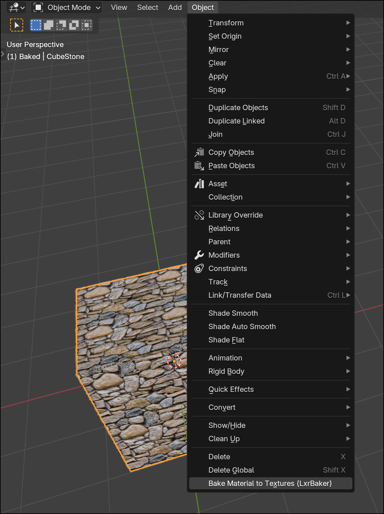
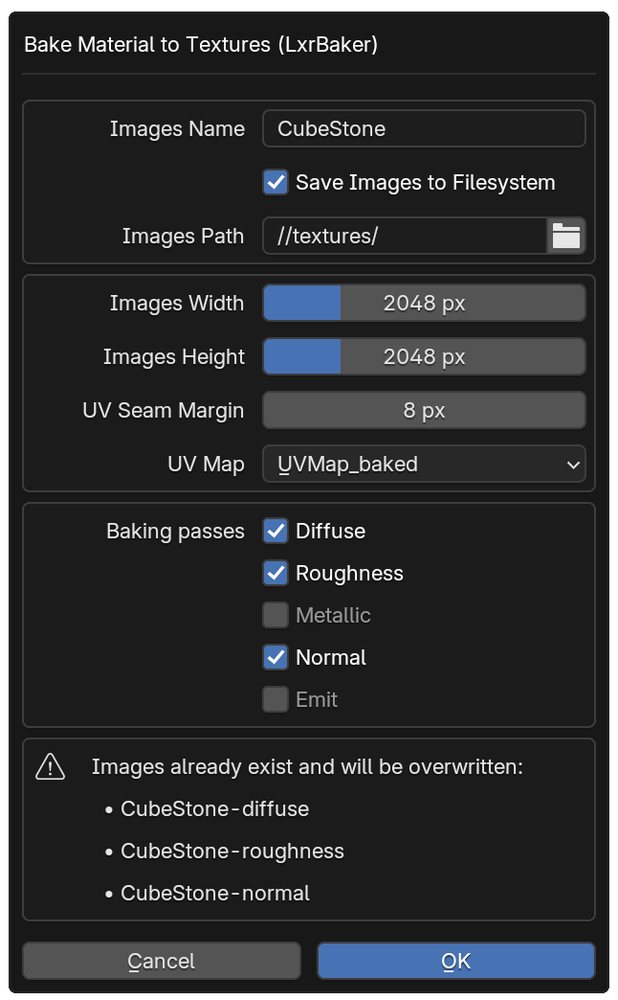

# LxrBaker - A Blender Add-on

An add-on for Blender that simplifies the baking workflow.
Features:
 * ✅ Baking the material of one object to textures
 * ❌ Baking the material of multiple object to the same textures
 * ❌ Baking of a high-res object to a low-res object

## How to use

### Bake one object

Select the object you want to bake, go to "Object" and select "Bake Material to Textures (LxrBaker)".

 Change the settings and press "OK".

The material of the selected object will then be baked to images.